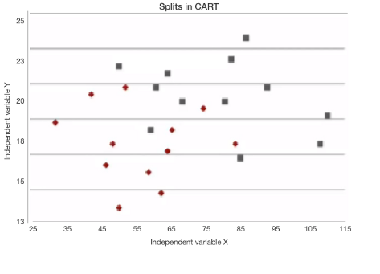

# Index

- How does Decision Tree work?
- Types of Decision Tree
- Additional Features
- Types of Boosting Algorithms
- Next Steps

## How does Decision Tree work?

  - Repeatedly split data into multi-subspaces
  - So each final sub-space is more or less homogeneous

  

- When splitting a node
  - consider every possible feature
  - pick one that produces the most separation between the observations
  

# Types of Decision Tree
  - Classification
  - Regression

# Classification Tree

## Classification Trees (I)

- We have categorical variables

  

## Classification Trees (II)

- We have categorical variables
- Predict qualitative response, instead of quantitative one
- Example: separate **red circles** and **grey squares**
  - Search for best split point over two variables
  - Stop when a leaf has data less than a minimum acceptable number 

  

## Classification Trees (III)

- Recursive binary splitting to grow a classification tree
  - **_Gini Index_**: measure of inequality of distribution
  
    $$Gini = 1 - \sum_{i} p_{i}^{2}$$

  - **_Entropy_**: measure of impurity
  
    $$Entropy = -\sum_{i} p_{i}log_{_2}p_{i}$$
  
  - **_Information Gain_**: after picking a particular attribute
  
    $$IG(D_{p}) = I(D_{p}) - \frac{N_{left}}{N_{p}}I(D_{left}) - \frac{N_{right}}{N_{p}}I(D_{right})$$
  
## Classification Trees (IV)

- We have categorical variables
- Predict qualitative response, instead of quantitative one
- Example: separate **red circles** and **grey squares**
  - Search for best split point over two variables
  - Stop when a leaf has data less than a minimum acceptable number

  
  

# Regression Tree

## Regression Trees (I)

- We have continuous variables
- Outcomes predict average of values in each leaf
- Minimize Residual Sum of Squares over $M$ subspaces ($SS$).

$$RSS = \sum_{i=1}^{M} \sum_{j \in Ss} (y_{j} - y_{SS_{i}})^2$$

## Regression Trees (II)

- We have continuous variables
- Outcomes predict average of values in each leaf

- Example 1: separate **red circles** and **blue circles**

  

## Regression Trees (III)

- We have continuous variables
- Outcomes predict average of values in each leaf

- Example 2: find the average of the values

  

# Additional Features

- Advantages and Disadvantages of Decision Trees
- Working with Prunning

## Advantages and Disadvantages of Decision Trees

- Advantages
  - Intuitively very easy to understand
  - Easy to identify most significant variables
  - Can be displayed graphically
  - There is no need to create dummy variables, in general
  
- Disadvantages
  - Prediction accuracy is not that high
    - A small split in data can cause large change in the final estimate

## Prunning the Tree

- The tree may be deep enough to result in overfitting
  - Possible solution
    - Prunning: removing sub-nodes of a decision tree
  - Drawback
    - Results may not increase significantly
- How to substantially improve results?
  - Boosting Algorithms: aggregating several decision tress
  

# Types of Boosting Algorithms

- Bagging
- Random Forest
- Gradient Boost Machines

## Bagging (Bootstrap Aggregation)

- Take different sub-samples of the same dataset
- Train over all features
- Get classifiers on each dataset
- Combine all classifiers and take the average

  

## Random Forest

- Take different sub-samples of the same dataset (as Bagging)
- Train over a random subset of features
  - Uncorrelated trees protect each other from errors
- In each case, choose the best feature to split the node
- Aggregate predictions of the target trees to predict new data

  

## Boosting (Gradient Boosting Machines)

- Each tree is grown using information from previous one
- After evaluating the first tree
  - increase weights of observations that are hard to classify
  - and lower the weights for those that are easy to classify
- In other words, given the current model
  - fit a tree using the current residuals
  - rather than the outcome
- This method slowly converts weak learners into strong ones

  

# Next Steps

- Implemt BDT to our data
- Check which type of BDT will better perform

