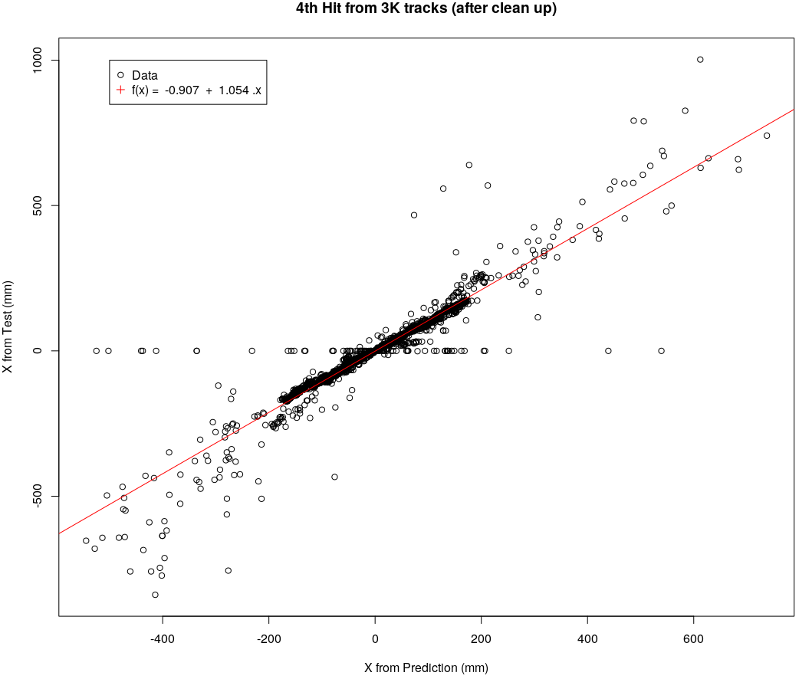

# Index

- Working with Gradient Boosting Machine (GMB)
- Looking closer in the data set 
- Cleaning up the data set
- Results after clean up 
- Next steps

# Working with GMB

## What does GBM do?

- Each tree is grown using information from previous one
- After evaluating the first tree
    - increase weights of observations that are hard to classify
    - and lower the weights for those that are easy to classify
- In other words, given the current model
    - fit a tree using the current residuals
    - rather than the outcome
- This method slowly converts weak learners into strong ones

  

## Let's try to predict the 5th tracking hit

- Sample of 10K tracks
- Training phase
    - Inputs for GBM:
        - x\_1, x\_2, x\_3, x\_4, y\_1, y\_2, y\_3, y\_4, z\_1, z\_2, z\_3, z\_4
        - 7K tracks
        - Number of trees = 200
        - Trees shrinkage = 0.1 (10%)
        - Trees interaction depth = 10
        - GBM distribution = gaussian
- Testing phase
    - 3K tracks
    - 39 trees between 10 and 200 (in steps of 5)

## Relative influence from each input coordinate

  

## Best number of trees for prediction (I)

- Trying to predict 5th tracking hit
- Compute Minimum Mean Squared Error for each number of tree $n_{tree}$
    - Considering
        - 39 trees between 10 and 200 (in steps of 5)
        - N = 3K tracks

$$MSE_{n_{tree}} = \frac{\sum_{i=1}^{N} (x^{Test}_{i} - x^{Predicted}_{i})^2}{N}$$

## Best number of trees for prediction (II)

- Minimum MSE = 3576 $mm^2$ for 45 trees

  

## Checking predicted results for 5th hit

- We observe a considerable fluctuation
- A dream case would be a straight diagonal line

  

# Looking closer in the data

## Plotting all hits in X-Y plane (I)

- Hits from 10K tracks with |z| < 300 mm
- We observe an overlay of the plates

  

## Plotting all hits in X-Y plane (II)

- Adding a track
- Some layers have more than 1 hit

  

## Plotting all hits in X-Y plane (III)

- If we try to predict the 5th hit using previous 4
    - It could bring difficult to GBM

  

## Plotting all hits in X-Y plane (IV)

- It seems we may have up to 4 hits in the same layer

  

## Plotting all hits in Z-Y plane

- And the same happens in Z-Y (or Z-X) plane
- So let's try to remove duplicated events

  

# Let's clean up the data set

## Method to clean up the data set (I)

- Compute 3D distance between each 2 subsequent hits
    - in the same track

  

## Method to clean up the data set (II)

- Looking closer
    - A pick for 3D distance < 20 mm seems to be due duplicated hits in the same layer

  

## Method to clean up the data set (III)

- Looking even closer
    - Shoud we consider a tighter cut?

  

## A cut of 20 mm is reasonable?

- Looking the central region of the detector
    - Distance between plates seems to be higher than 20 mm
    - So a cut in 20 mm looks fine

  
  

## Comparing tracks after clean up (X-Y)

  

## Comparing tracks after clean up (Z-Y)

  

## Predicted results after clean up (I)

- What about the horizontal points in a straight line?
- Does it seem reasonable? Actually it is pure Physics!!!

  

## Predicted results after clean up (II)

- It seems GBM has learned Physics
    - finding a 5th hit even when there is no hit

  

## Predicted results after clean up (III)

- Now for Y and Z predictions
- Results are not satisfied for Z, needing more studies

  
  

# Next Steps

## To-Do-List

- Tune GBM parameters
- Try to predict all the other hits in the track
- Find nearest neighbor point of a predicted point

# Moving ahead

## Tune GBM parameters

- Training sample (7K tracks) to find 5th hit (from previous 4)
    - Shrinkage = 9, Interaction deepth = 10

  

## Clustering heat map cells

- Unfortunately, Minimum MSE = 4454 mm$^2$
    - which corresponds to 6.6 cm (error too big!!!)

  

## New idea: cutting out parameters (I)

- Let's try to predict a 4th point from previous 3 ones
- Minimum MSE = 2122 mm$^2$ (4.6 cm)

  

## New idea: cutting out parameters (II)

  

# Next steps (finally)

- Counting out more parameters
- Try to predict all the other hits in the track
- Find nearest neighbor point of a predicted point

